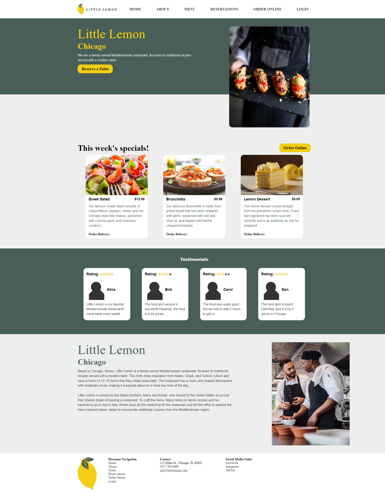
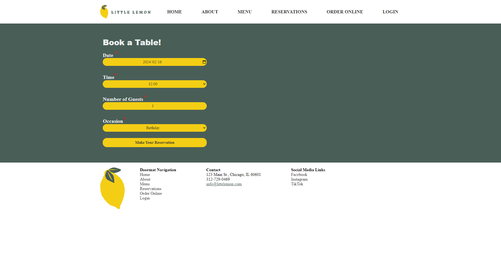
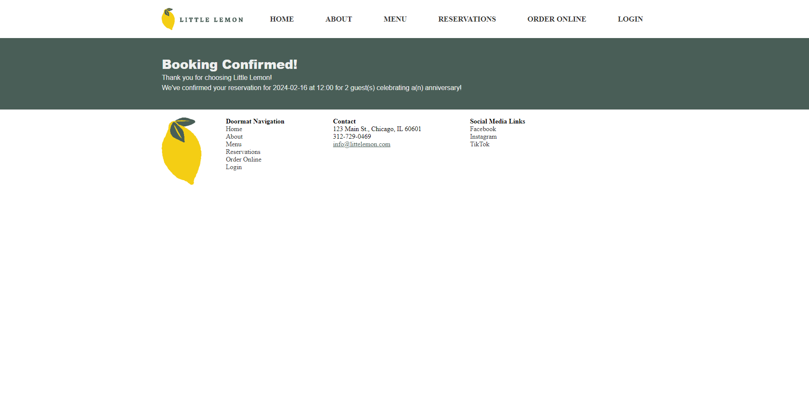
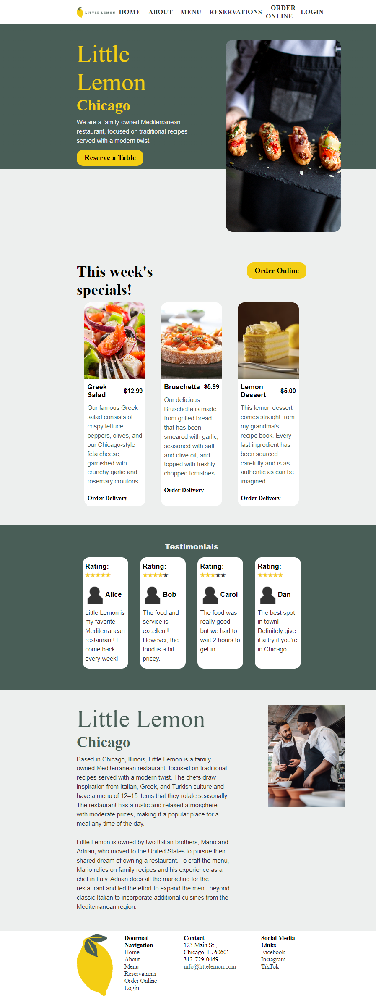
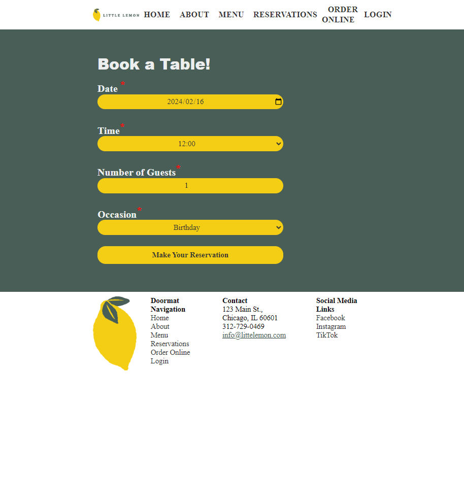
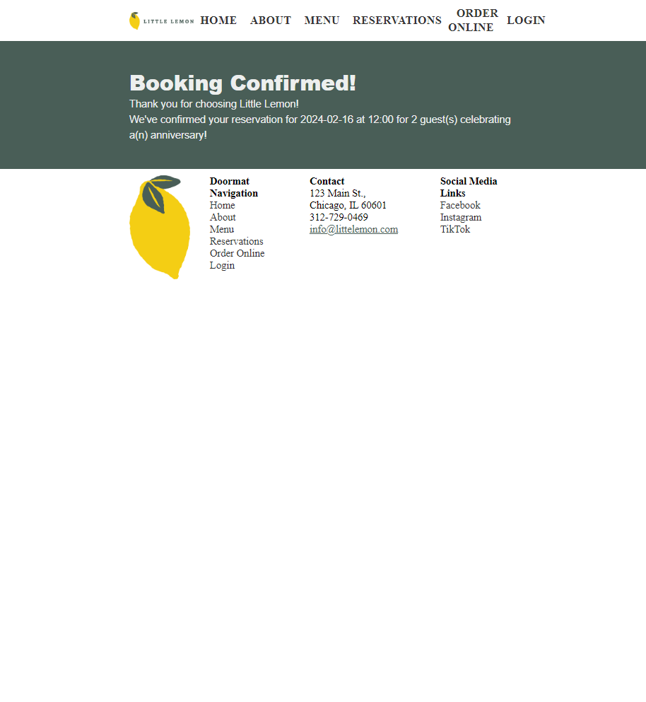

# Little Lemon Website
This project is a React app for a website for a fictitious restaurant called Little Lemon for the Meta Front-End Developer Capstone course.

## Demonstration

### Desktop
Here is a screenshot of the full homepage on a desktop layout.

Here is a screenshot of the booking page on a desktop layout.

Here is a screenshot of the booking confirmation page on a desktop layout.

### Mobile
Here is a screenshot of the full homepage on a mobile layout. (Note that it shows more than a phone screen would.)

Here is a screenshot of the booking page on a mobile layout.

Here is a screenshot of the booking confirmation page on a mobile layout.

## Layout
### App
The main app is in the `App.js` file.

It uses React Router Dom to create the routes for all the pages. (Note that the Router is in index.js.) It has the following routes: `/` (homepage), `/about` (about page), `/menu` (menu page - under construction!), `./booking` (reservations page), `/order` (online ordering page - under construction!), `/login` (login page - under construction!), `/confirmed` (reservation/booking confirmation page).

### Styling (App.css)
All the CSS styling is done in App.css. Each component has its unique classes to differentiate styling between components. The styling for each component have been grouped together in the same section.

## Components

### Nav
This is the nav bar. It uses React Router Dom links for the navigation links.

It has the logo (which links to the homepage), **Home** (which links to the homepage), **About** (which links to an about page), **Menu** (which links to a menu page - under construction!), **Reservations** (which links to a booking page), **Order Online** (which links to an ordering apge - under construction!), and **Login** (which links to a login page - under construction!)

### Footer
This is the footer. It use React Router Dom links for the footer doormat navigation links. Regular anchor tags (``) are used for the external links to the social media and for the e-mail.

The address, phone number, and e-mail are fake. The Instagram account is real (and likely created by Meta). The Facebook and TikTok pages do not actually exists, and the user handles are based on the Instagram account user handle.

### Hero Section
This is the hero section of the page. It contains the restaurant name and city in addition to an image of a person holding food, a short description, and a button that links to the Bookings/Reservations page.

### Highlights
This is the highlights section, which shows "This week's specials."

The menu items are displayed using a list of objects and displaying them with the `MenuCard` component.

### Testimonials
This is a testimonials/reviews section.

The reviews are displayed using a list of object and displaying them with the `TestimonialCard` component.

### About
This is an about section that gives some information about the restaurant. The text is taken from provided text given for the final project of Meta's *HTML and CSS in depth* course.

### Booking
This is a page with a booking/reservation form. It has fields for the date, time, number of guests, and occasion. The date and number of guests have form validation that will display an error message if the input is invalid. The **Make a Reservation** button will also be disabled if not all form fields are valid; this is shown by the color darkening.

With the default fields, the form is valid, but the fields can be changed to make it invalid.

### Booking Confirmation
This is the booking confirmation page, which also displays the submitted information.

### Menu
Under construction!

### Login
Under construction!

### Order
Under construction!

## Available Scripts

In the project directory, you can run:

### `npm start`

Runs the app in the development mode.\
Open [http://localhost:3000](http://localhost:3000) to view it in your browser.

The page will reload when you make changes.\
You may also see any lint errors in the console.